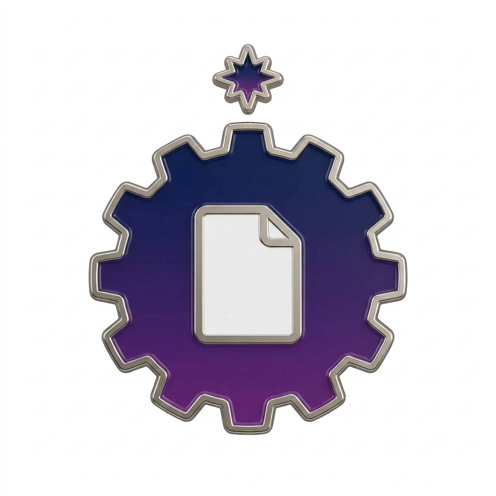

  <!--
    [이미지 1] logo.png  ★ 최우선 제작
    종류: AI 생성 (나노바나나)
    크기: 512×512 → 표시 120px
    내용: 기어 안에 문서 아이콘 + 상단 별 반짝임, 네이비-퍼플 그라데이션, 플랫 디자인
    나노바나나 프롬프트:
      "미니멀 플랫 앱 아이콘, 기어 안에 문서 아이콘, 상단에 작은 별 반짝임,
       네이비 투 퍼플 그라데이션, 흰 배경, 클린 테크 스타트업 스타일, 512×512"
    저장 위치: jasoseo-machine/assets/images/logo.png
  -->
  

<h1 align="center">자소서 머신 (Jasoseo Machine)</h1>

  <strong>"경험을 넣으면 합격 자소서가 나옵니다."</strong> 
  채용 공고 자동 수집 → AI 9단계 정제 → 채용 사이트 자동 입력까지 
  <b>완전 자동화된 자소서 생산 파이프라인</b>

  
  
  
  

---

<!--
  [이미지 2] hero-concept.png  ★ 두 번째 우선순위
  종류: AI 생성 (나노바나나)
  크기: 1280×540 → 표시 860px
  내용: 자소서 공장 이소메트릭 단면도
    - 왼쪽: 이력서 PDF 스택이 컨베이어 벨트에 올라감
    - 중앙: 9개의 AI 처리 스테이션 (파란 홀로그램 패널, 로봇 팔)
    - 오른쪽: 완성된 자소서 문서가 깔끔하게 출력됨
    - 오른쪽 구석: 작은 사람 실루엣이 팔짱 끼고 모니터 앞에 서있음 (유저는 그냥 지켜봄)
    - 분위기: 다크 배경, 네온 블루-퍼플 조명, 미래적 정밀 공장
  나노바나나 프롬프트:
    "isometric automated factory interior cross-section illustration,
     left: stack of PDF resume documents on conveyor belt entering,
     center: 9 AI processing stations with holographic blue panels and robotic arms,
     right: finished polished cover letter documents coming out neatly,
     small human silhouette with arms crossed standing at monitor on far right watching,
     dark background #0d1117, neon blue and purple lighting accents,
     clean minimal tech illustration style, no text labels, wide 2:1 ratio"
  저장 위치: jasoseo-machine/assets/images/hero-concept.png
-->

  <picture>
    <source media="(prefers-color-scheme: light)" srcset="./jasoseo-machine/assets/images/hero-concept-light.png"/>
    <source media="(prefers-color-scheme: dark)"  srcset="./jasoseo-machine/assets/images/hero-concept-dark.png"/>
    
  </picture>

---

##  Demo Showcase

<!--
  [이미지 3] hero.gif  ★ 세 번째 우선순위
  종류: 앱 실제 화면 녹화
  크기: 표시 860px, 24fps, 25~35초
  촬영 순서:
    1. 대시보드 화면 (2초 — 전체 UI 첫인상)
    2. "새 지원서" → URL 입력창 (3초)
    3. 채용 URL 붙여넣기 → "공고 분석" 클릭 (3초)
    4. Step 0 기업 분석 결과 확인 (3초)
    5. Step 2 에피소드 매칭 카드 선택 (3초)
    6. Step 3 생성 시작 → 재밌는 멘트 + shimmer 바 (3초)
    7. 스트리밍 글자 채워지는 장면 (8~10초 — 핵심)
    8. Full Review 완성 화면 (3초)
  저장 위치: jasoseo-machine/assets/images/hero.gif
-->

  

---

##  Key Features

<table>
<tr>
<td width="50%" valign="top">

###  매직 온보딩
이력서 PDF를 드래그하면 AI가 면접관 시각으로 경험을 분석해 
**S-P-A-A-R-L 구조의 에피소드**로 자동 변환합니다. 
추가 입력 없이 경험 라이브러리가 완성됩니다.

</td>
<td width="50%">

<!--
  [이미지 4] onboarding.gif
  종류: 앱 실제 화면 녹화
  크기: 표시 430px, 15~20초
  촬영 순서:
    1. 대시보드 → "✨ 매직 온보딩" 버튼 클릭
    2. PDF 파일 드래그 드롭 (천천히, 드래그 궤적 보이게)
    3. AI 처리 로딩 애니메이션 3~5초
    4. 에피소드 카드들이 순차적으로 나타남
  강조 포인트: PDF 한 장 → 카드 여러 개로 변환되는 마법 순간
  저장 위치: jasoseo-machine/assets/images/onboarding.gif
-->

</td>
</tr>

<tr>
<td width="50%">

<!--
  [이미지 5] smart-mode.gif
  종류: 앱 실제 화면 녹화
  크기: 표시 430px, 10~15초
  촬영 순서:
    1. "새 지원서" 클릭 → URL 모드 탭 선택
    2. 채용 사이트 URL 붙여넣기 (천천히 타이핑하듯)
    3. "공고 자동 분석" 버튼 클릭
    4. 로딩 → 문항 목록 자동 생성 완료
  강조 포인트: URL 1개 입력 → 문항이 뚝딱 나오는 순간
  저장 위치: jasoseo-machine/assets/images/smart-mode.gif
-->

</td>
<td width="50%" valign="top">

###  스마트 URL 모드
채용 사이트 URL 하나만 붙여넣으면 
**채용공고 · 자소서 문항 · 인재상**을 AI가 자동 수집합니다. 
복사·붙여넣기도 필요 없습니다.

</td>
</tr>

<tr>
<td width="50%" valign="top">

###  9단계 AI 파이프라인
기업 전략 해석 → 질문 재해석 → 에피소드 매칭 
→ S-P-A-A-R-L 구조 실시간 생성 → **3중 검증** 
할루시네이션 방지 / 탈락패턴 제거 / 이중코딩 검증

</td>
<td width="50%">

<!--
  [이미지 6] generation.gif
  종류: 앱 실제 화면 녹화
  크기: 표시 430px, 20~25초
  촬영 순서:
    1. Step 2 에피소드 매칭 화면 (2초)
    2. "생성 시작" 클릭 → 재밌는 멘트 로테이션 + shimmer 바 (4초)
    3. 첫 글자 등장 → 스트리밍 (12~15초 — 핵심 장면)
    4. 상단 진행 바 + 글자수 카운터 포함되도록 구도 잡기
  강조 포인트: 자소서 글자가 촤르륵 채워지는 스트리밍 장면
  저장 위치: jasoseo-machine/assets/images/generation.gif
-->

</td>
</tr>

<tr>
<td width="50%">

<!--
  [이미지 7] extension.gif
  종류: 앱 실제 화면 녹화 (Chrome 화면 위주)
  크기: 표시 430px, 10~15초
  촬영 순서:
    1. Full Review 화면 → "확장으로 전송" 버튼 클릭 (2초)
    2. Chrome 채용사이트 (빈 텍스트박스들이 보이는 상태)로 전환
    3. Chrome 확장 팝업 아이콘 클릭 → "자동 입력" 버튼
    4. 여러 텍스트박스가 순차적으로 빠르게 채워지는 클라이맥스 (6~8초)
  강조 포인트: 빈칸들이 한번에 채워지는 마지막 장면 (가장 임팩트 있는 순간)
  저장 위치: jasoseo-machine/assets/images/extension.gif
-->

</td>
<td width="50%" valign="top">

###  Chrome 자동 입력
완성된 자소서를 복사·붙여넣기 없이 
Chrome 확장이 채용 사이트 폼에 **원클릭 자동 입력**합니다. 
아이프레임·섀도우DOM 영역까지 침투합니다.

</td>
</tr>
</table>

---

##  User Guide Index
처음 방문하셨나요? 아래 가이드를 순서대로 따라오시면 단 10분 만에 첫 자소서를 완성할 수 있습니다.

| 단계 | 가이드 제목 | 주요 내용 |
| :--- | :--- | :--- |
| **Step 1** | [ 환경 설정 및 설치](./jasoseo-machine/guides/GUIDE_01_SETUP.md) | CLI 설치 및 앱-AI 연결 |
| **Step 2** | [ 나의 무기 만들기](./jasoseo-machine/guides/GUIDE_02_LIBRARY.md) | 이력서 기반 경험 데이터화 |
| **Step 3** | [ 자소서 생성 및 자동 제출](./jasoseo-machine/guides/GUIDE_03_GENERATE.md) | 위저드 활용 및 크롬 연동 |

---

##  Prerequisites & Disclaimers

###  Privacy & Security (개인정보 보호)
- **100% Local Execution**: 본 프로그램은 모든 작업을 유저의 로컬 환경에서 수행합니다. 업로드한 이력서와 입력한 개인정보는 **외부 서버로 전송되지 않으며**, 오직 유저 본인이 설치한 AI CLI(Gemini/Claude)로만 전달됩니다. 개발자를 포함한 그 누구도 귀하의 데이터에 접근할 수 없습니다.
- **No API Key Storage**: 본 앱은 별도의 API 키를 요구하거나 서버에 저장하지 않으므로, 키 유출 위험으로부터 안전합니다.

###  Technical Requirements
1. **AI 서비스 구독 및 CLI 설치**: 로컬 환경에 **Gemini CLI** 및 **Claude Code CLI**가 설치되어 있어야 하며, 구동 가능한 토큰 할당량을 보유해야 합니다.
2. **Gemini CLI 설정 충돌 주의**: Gemini CLI는 로컬 사용자 폴더(`C:\Users\[User]\.gemini`)의 설정값을 최우선으로 따릅니다. **유저가 설정한 개인 세팅값이 본 프로그램의 프롬프트보다 강제성이 높을 경우**, 정상적인 자소서 생성이 어려울 수 있습니다. (원활한 작동을 위해 기본 설정을 권장합니다.)
3. **토큰 소진 및 모델 제한**: 자소서 생성 및 검증 시 상당량의 토큰이 소모될 수 있습니다. 또한 현재 개발 환경 제약으로 **GPT 엔진은 지원하지 않습니다.**

###  Pattern Accuracy
- **100% Success Rate**: 본 툴에 내장된 패턴은 실제 합격률 100%를 기록한 사례들을 분석한 결과입니다.
- **Overfitting Risk**: 다만 분석 표본의 양적 한계로 인해 특정 패턴에 **과적합(Overfitting)**되어 있을 수 있습니다. 모든 기업과 직무에서의 결과를 보장하지 않으므로 최종 검토는 반드시 본인이 직접 수행하시기 바랍니다.

---

##  Tech Stack
- **Frontend**: React 19, Tailwind CSS, Zustand, Lucide Icons
- **Backend**: Electron, Node.js (Main Process), Express (Bridge Server)
- **AI Core**: Gemini CLI (Google), Claude Code CLI (Anthropic)
- **Automation**: WebSocket Bridge, Chrome Extension (Manifest v3)

---

##  License
본 프로젝트는 **비영리 목적(Non-Commercial)**의 개인적 사용 및 학습용으로만 배포됩니다. 저작권자의 서면 동의 없는 상업적 이용, 유료 서비스화, 코드 도용 및 재배포를 엄격히 금지합니다. 상세 내용은 [LICENSE](./LICENSE) 파일을 확인해 주세요.

---

##  How to Contribute
여러분의 기여는 환영하지만, 본 프로젝트의 라이선스 정책을 준수해야 합니다. 자세한 절차는 [CONTRIBUTING.md](./CONTRIBUTING.md)를 참조해 주세요.

  Developed with ❤️ for all job seekers in the AI Era.

